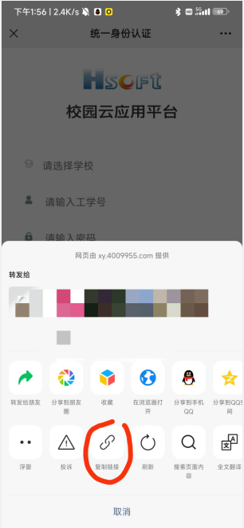

# HITwh Daily Report

HITwh 工软系统 [访问入口](http://xy.4009955.com/jktb/) 上报脚本

感谢 [@Cheryio](https://github.com/Cheryio) 提供[原始脚本](https://github.com/Cheryio/GRXY_autoSign)和 [idea](https://www.lyri.fun/posts/cab45a56/)。
TA的博客：[lyri.fun](https://www.lyri.fun/)

感谢 [HITsz-daily-report](https://github.com/chh13502/HITsz-daily-report)

## 免责声明

本脚本为减轻导员和负责人/班长通知成本而诞生，作者不对任何因个人瞒报而破坏疫情防治工作的行为负责！

##### 如果有发热状况，请及时私信通知导员！！！！
#### 如果有发热状况，请及时私信通知导员！！！！
### 如果有发热状况，请及时私信通知导员！！！！

## 使用方法
### 关于OPENID([来源](https://www.lyri.fun/posts/cab45a56/))
进入**工软校园公众号**，点击**应用中心**，切换到**我的**，如果你是已登录的状态就退出登录，然后跳转进入到这个登录界面

点**复制链接**，然后查看链接的内容

这样就得到了你的openid

### 本地运行脚本（Windows）
1. 安装Python环境
2. `pip install -r requirements.txt` 安装依赖
3. 编辑项目中的`report.bat`，填写好 用户名 `USERNAME` 、密码 `PASSWORD` 、姓名`XM`、学院`XUEYUAN`、openid`OPENID` 
4. 双击`report.bat`即可
5. P.S. 如果使用Python虚拟环境，可以删除第七行`@REM call .\venv\Scripts\activate.bat`中的`@REM `

### GitHub Action
1. `Fork` 仓库
2. 设置仓库的 Actions Secrets [如何设置？](./how-to-enable-actions/#添加-Secrets)  
   填写好如下表中Secrets

|   Name   |      Value      |
|:--------:|:---------------:|
| USERNAME | HITwh 工软用户名（学号） |
| PASSWORD |   HITwh 工软密码    |
|    XM    |      中文姓名       |
| XUEYUAN  |       学院        |
|  OPENID  |     openid      |

3. 开启 GitHub Actions [如何开启？](./how-to-enable-actions/#启用-Actions)
4. 每天早上 ~~07:40 23:40 UTC~~ 不知道什么时候定时自动运行  
> [Note](https://docs.github.com/en/actions/using-workflows/events-that-trigger-workflows#schedule): The `schedule` event can be delayed during periods of high loads of GitHub Actions workflow runs. 
> High load times include the start of every hour. 
> To decrease the chance of delay, schedule your workflow to run at a different time of the hour.
> 西巴，怎么每天延迟两小时运行。

你可以打开 GitHub Actions 执行的全局邮件通知 [如何开启？](./how-to-enable-actions/#设置邮件提醒)，包括成功或失败信息

## 声明
用户使用过程中输入的账户、密码等信息仅用做登陆认证凭据，脚本未对任何个人信息与登陆凭据进行非法留存、转发等操作，尽情放心使用。欢迎核查

## 推荐
推荐隔壁项目[Apoois/HITwh-daily-report](https://github.com/Apoois/HITwh-daily-report)，功能更全，架构清晰，作为一名理工男我觉得这太酷了，很符合我对未来生活的想象，科技并带着趣味。
